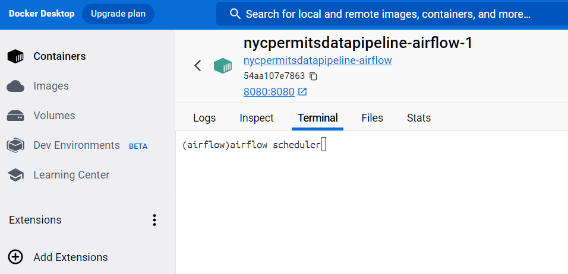
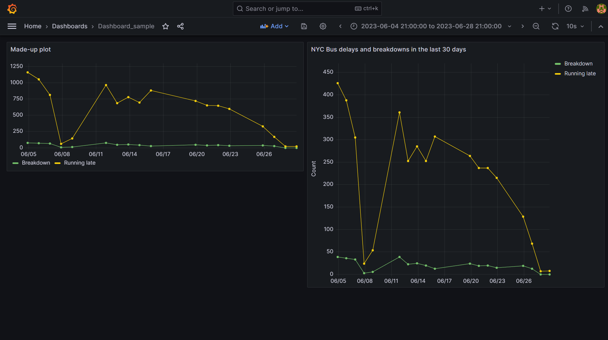

# NYC Bus Data Ingestion Project

This project utilizes Docker to construct an end-to-end data pipeline for ingesting, processing, and visualizing NYC bus data. The pipeline, implemented as a Directed Acyclic Graph (DAG) using Apache Airflow, stores data in a PostgreSQL database and uses Grafana for visualization.

## Project Structure

```plaintext
.
├── airflow                 # Airflow Dockerfile and configuration
│   ├── Dockerfile
│   └── dags                # Directory for your Airflow DAGs
│       └── nyc_bus_data_ingestion.py
├── grafana                 # Grafana configuration
│   ├── provisioning
│   │   ├── dashboards
│   │   └── datasources
└── docker-compose.yml      # Docker Compose file to start services
```


## Services

- PostgreSQL: Database service for storing NYC bus data.
- pgAdmin4: Web interface for managing PostgreSQL database.
- Airflow: Workflow management system for creating and scheduling data pipelines.
- Grafana: Platform for visualizing and analyzing data.


## Accessing Services
- Airflow: Access at http://localhost:8080. Use the credentials `admin:admin` to log in.
- pgAdmin4: Access at http://localhost:5050. Use the credentials `pgadmin@pgadmin.com:admin` to log in. Connect to the PostgreSQL server with the credentials admin:admin.
- Grafana: Access at http://localhost:3000. Use the credentials `admin:admin` to log in.


## Setup & Running

1. Install Docker and Docker Compose if not already installed.

2. Clone this repository:

```bash
git clone https://github.com/user/repository.git
cd repository
```

3. Build and start services:

```bash
docker-compose up -d --build
```

4. Open the Airflow container terminal (you can use Docker Desktop) and execute the following command:
```bash
airflow scheduler
```

The fourth step is visually represented below:




5. Log in into airflow interface through http://localhost:8080. Use the credentials `admin:admin` to log in.
6. Turn on the DAG nyc_permit_data_ingestion
7. Grafana will be updated automatically once the view is created. Also, you can modify the view accessing through pgAdmin4 and Grafana will automatically update the view after a few seconds.


## Workflow
The data ingestion workflow (nyc_bus_data_ingestion) is scheduled to run daily at 12:00 PM. The workflow performs the following steps:

1. Create a connection to the PostgreSQL database.
2. Fetch the NYC bus data from the [data.cityofnewyork.us API](https://data.cityofnewyork.us/Transportation/Bus-Breakdown-and-Delays/ez4e-fazm)
3. Create a table nyc_bus_data in the PostgreSQL database if it doesn't exist.
4. Save the fetched data to the PostgreSQL database.
5. Create a view in the PostgreSQL database to count the occurrences of bus breakdowns and delays over the past 30 days.
6. Enables Grafana to create a dashboard to visualize the count_of_occurrences view.


